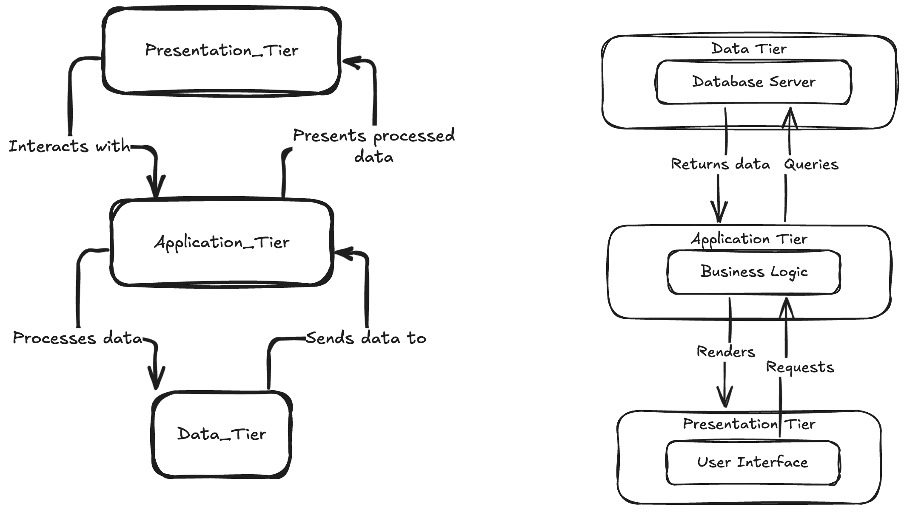
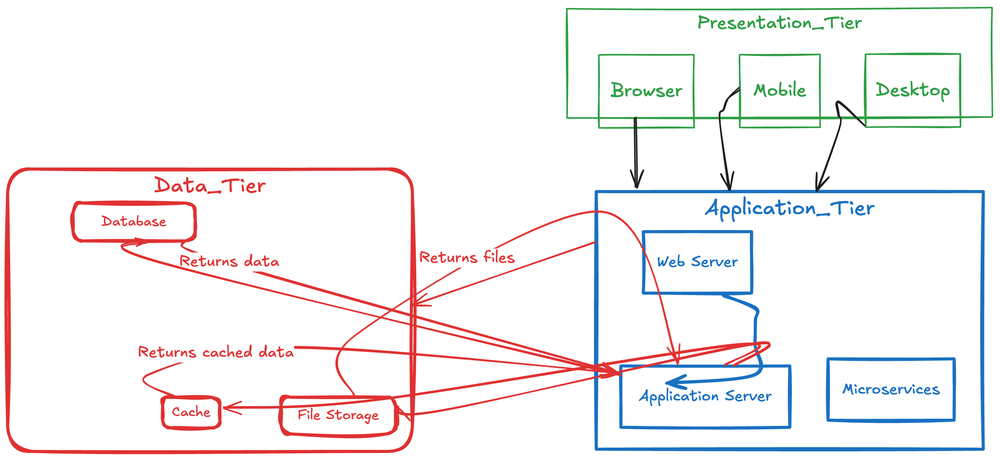

# Three-Tier Architecture

The **three-tier architecture** is a common software architecture pattern that separates applications into three logical layers: **Presentation Layer**, **Application/Business Logic Layer**, and **Data Layer**. This separation improves scalability, maintainability, and modularity.

---

## 1. Presentation Layer (UI Layer)

- **Purpose**: The layer that interacts with users to display data and capture input.
- **Responsibilities**:
  - Render user interfaces (UI).
  - Collect user inputs and send them to the application layer.
  - Display data returned from the application layer.
- **Examples**:
  - HTML pages or SPAs rendered by React, Angular, or Django Templates.
  - Mobile applications built with Flutter or React Native.
  - A course catalog page displaying available courses and collecting enrollment requests.

---

## 2. Application Layer (Business Logic Layer)

- **Purpose**: Processes user requests, applies business rules, and interacts with the data layer.
- **Responsibilities**:
  - Validate user input and enforce application-specific logic.
  - Handle security aspects like authentication and authorization.
  - Manage data exchange between the presentation and data layers.
- **Examples**:
  - APIs created with Django Rest Framework (DRF) to handle enrollment requests.
  - Middleware validating user authentication tokens.
  - Calculations like applying discounts during a checkout process.

---

## 3. Data Layer

- **Purpose**: Handles data storage, retrieval, and management.
- **Responsibilities**:
  - Store structured or unstructured data.
  - Provide efficient data querying and transaction management.
  - Ensure data integrity and consistency.
- **Examples**:
  - A PostgreSQL database storing user and course data.
  - Redis caching user session data for faster access.
  - A NoSQL database (like MongoDB) managing course content metadata.

---

## Benefits of Three-Tier Architecture

1. **Separation of Concerns**: Each layer has its dedicated responsibility, making the application easier to understand and manage.
2. **Scalability**: Each layer can be scaled independently based on demand.
3. **Maintainability**: Isolated layers simplify updates, testing, and debugging.
4. **Reusability**: Components like APIs or database models can be reused across different projects.
5. **Flexibility**: Developers can use different technologies in each layer (e.g., React for the presentation layer, Django for the application layer, and PostgreSQL for the data layer).

---

## Workflow Example

A student enrolling in a course might involve:

1. **Presentation Layer**: The user selects a course and clicks "Enroll."
2. **Application Layer**: The backend validates the request, updates the database, and triggers an email confirmation.
3. **Data Layer**: The database stores the enrollment details and updates the student’s profile.

---

This architecture is widely used for web applications, mobile apps, and enterprise systems, ensuring a clear separation of responsibilities while providing flexibility and scalability.

### MVC Architecture

Most of the web frameworks implement the MVC (Model-View-Controller) architecture.
The MVC design pattern separates the entire web application development process into three layers, Model, View and Controller.
In the MVC approach, the controller intercepts the user requests.
It coordinates with the view and model layers to send the appropriate response back to the client.
The model is responsible for data definitions, processing logic and interaction with the backend database.
The view is the presentation layer of the application.
