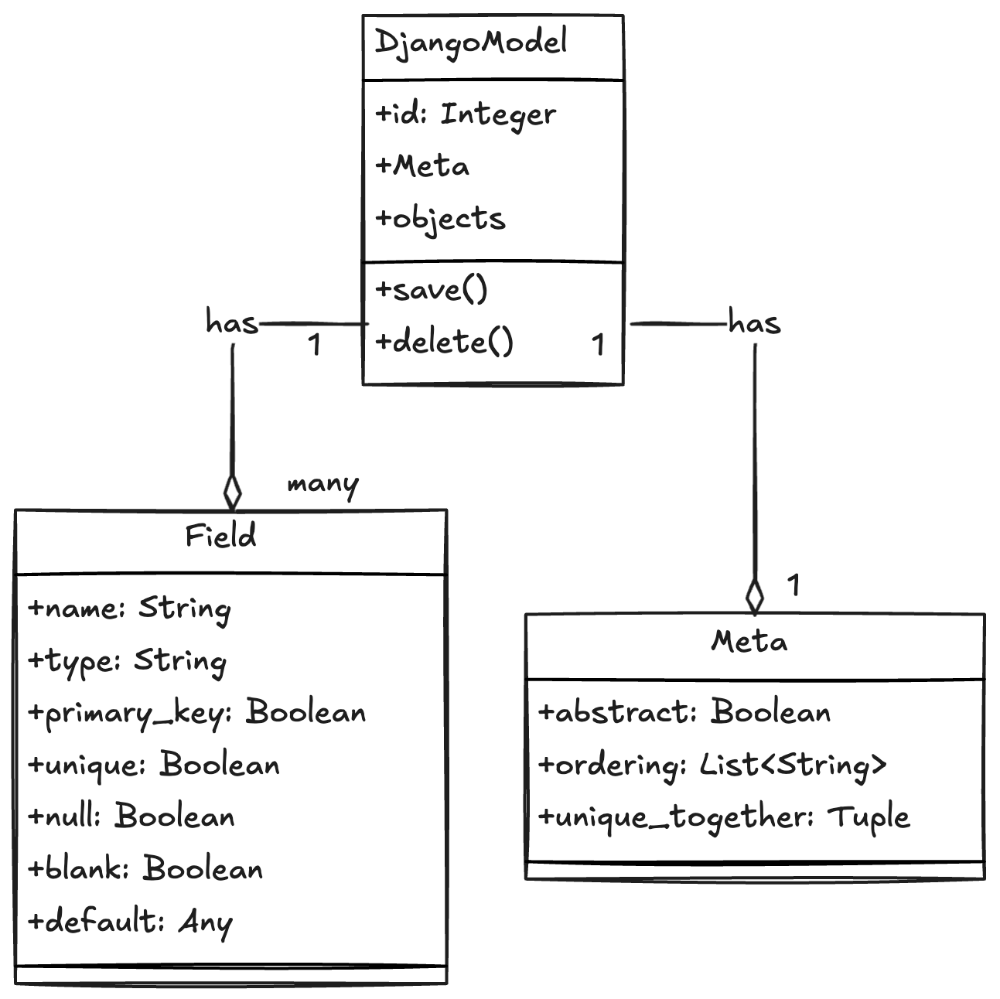

To work in a backend env, either we have to work directly with the data base or use an external framework to make the progress smoother, Model is one of such framework.

### working with database

- create the required tables in database
- make custom queries in the application to work with the database.

### working with framework

- add a middle layer called model between the application and database
- it communicates between the database and application

## model

A model is a class that defines the structure of a database table, including fields (columns) and their behaviors. Each model corresponds to a single table in the database

- a single, definitive source of information about our data.
- it contains essential fields and behaviors
- it maps to a single database table
- it provide a high-level abstraction for defining tables, fields, and relationships, helping us avoid writing raw SQL queries manually.
- each model subclasses `django.db.models.Model`
- When we create a model by subclassing `django.db.models.Model`, we inherit all the built-in functionality that Django provides for interacting with the database.
- each attribute of a model represents a database field
- replace the custom queries using model
- django provides data-base- API to access the database with python code.

### Purpose:

Models are used to define the schema of our database in Python code, allowing us to perform operations like creating, reading, updating, and deleting records (known as CRUD operations) without writing raw SQL.

It provides an abstraction layer, allowing us to focus on the logic of the application rather than the intricacies of database queries.

### Database Interaction:

Django uses an Object-Relational Mapping (ORM) system. With the ORM, each row in a database table is represented as a Python object, and operations on these objects translate into database queries.

### Structure:

A model has attributes that define the columns of the table, and Django automatically generates SQL queries to create the corresponding database structure.

## Why Use Models in Django?

`Simplifies Database Management`:

- Models abstract away raw SQL, allowing us to interact with the database using Python objects and methods.

`Centralized Data Management`:

- All data structures (tables, fields, relationships) are defined in one place (the model), creating a definitive source of truth for our data.

`Automatic Query Generation`:

- Django provides built-in methods to easily query the database without needing to write custom SQL.

A model helps us to `CREATE, READ, UPDATE, AND DELETE` objects.

## Key Features Inherited by Subclassing:

- `Field`: we can define various types of fields (e.g., CharField, IntegerField, DateTimeField) as attributes of the class.
- `Meta Options`: we can use an inner Meta class to provide additional options such as ordering or the database table name.
- `Methods`: Models have methods like `save(), delete(), and get_absolute_url()` that allow us to manage and retrieve records.
- `QuerySets`: Django provides methods like .`filter(), .all(), and .exclude()` to fetch data from the database.

## How Models Work

#### 1.Defining a Model:

Each model in Django maps to a single database table.

A model is a class that subclasses django.db.models.Model, and each attribute of the model represents a column in the corresponding table.

```python
from django.db import models
class User(models.Model):
    first_name = models.CharField(max_length:90)
    last_name = models.CharField(max_length:90)
```



#### 2.Attributes as Fields:

The model's attributes correspond to columns in the database.
Django supports various field types, such as CharField, IntegerField, BooleanField, DateField, and many more.

This model defines a User table with two columns, first_name and last_name, both of which are character fields.

## Built-in Model Methods:

Models come with built-in methods for CRUD (Create, Read, Update, Delete) operations.

1. create:

```py
user = User.objects.create(first_name="John", last_name="Doe")
```

2. Read:

```py
user = User.objects.get(id=1)
users = User.objects.all()
```

3. Update:

```py
user = User.objects.get(id=1)
user.first_name = "Jane"
user.save()

```

4. Delete:

```py
user = User.objects.get(id=1)
user.delete()
```

## Automatic Table Creation:

Once we define our models, us can create the corresponding database tables by running the following commands:

```sh
python manage.py makemigrations
python manage.py migrate
```

## Migrations

Records changes made to models and implements these changes to the database schema.
Django translates the models into respective database tables in the backend database with a mechanism known as migration. It also propagates any changes in the model structure such as adding, modifying or removing a field attribute of a model class to the mapped table.
Django migrations allow us to add, modify, and delete models or fields without needing to manually alter our database.

Django’s migration is a version control system. Whenever you add a new model or effect changes in an existing model, you need to run the `makemigrations` command. It creates a script for making changes in the mapped table. Every time you run the `makemigrations` command and Django detects the changes, a script with its name and version number is created. To implement the changes according to the migration script, you need to run the `migrate` command

## 1. `python manage.py makemigrations`

#### Purpose:

This command creates migration files based on changes you’ve made to your models (in models.py).

#### What it does:

It detects changes to the models in your Django app, such as creating new models, modifying fields, or deleting models/fields.
It generates new migration files that contain the necessary information to alter the database schema. These migration files are Python files that describe the changes in a way Django can apply them later.

#### What it doesn’t do:

It does not make any changes to the actual database. It only prepares the changes and stores them in migration files.

#### Example:

If you add a new model or field in models.py, running ` python manage.py makemigrations` will generate a migration file like `0002_auto_20211006_1523.py`, which contains the instructions to add that model or field to the database.

## 2. `python manage.py migrate`

### Purpose:

This command applies the migration files to the actual database, altering the database schema according to the instructions in the migration files.

### What it does:

It executes the migrations created by makemigrations by running the necessary SQL commands to modify the database schema.
It applies the changes to the database, such as creating new tables, adding or modifying fields, or removing models/tables.

#### What it doesn’t do:

It does not generate new migration files. It only applies existing migration files to the database.

#### Example:

After running python manage.py makemigrations, if you run python manage.py migrate, it will apply the changes in the migration file to the database, like creating new tables or adding columns.

```sh
python manage.py makemigrations
python manage.py showmigrations
python manage.py migrate
# shows sql command
manage.py sqlmigrate myapp
```

Django will automatically translate our Python model into the necessary SQL to create the tables in the database.

## using custom sql

```sql
CREATE TABLE user(
    "id" serial NOT NULL PRIMARY KEY
    "first_name" varchar(30) NOT NULL
    "last_name" varchar(30) NOT NULL
)
```

| Command                           | What it does                                           | What it doesn’t do                  |
| --------------------------------- | ------------------------------------------------------ | ----------------------------------- |
| `python manage.py makemigrations` | Detects changes to models and creates migration files  | Does not modify the database        |
| `python manage.py migrate`        | Applies migration files and alters the database schema | Does not create new migration files |

## schema

a schema is a blueprint or structure that defines how data is organized and how the relationships among different entities are managed within a database.

A schema

- specifies the tables in a database, fields in table
- determines the relationship between the tables, one-to-many, one-to-one, many-to-many
