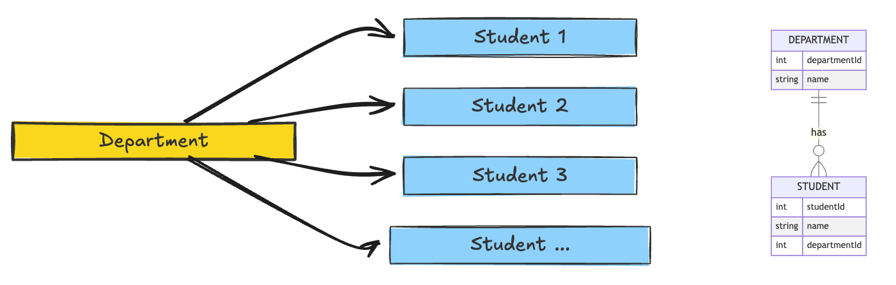

## `Many-To-One` or `One-To-Many` (ForeignKey)

a primary key of one table that can be used in another table is known as foreign key.
ForeignKey represents a many-to-one relationship, where multiple instances of one model (child) can be associated with a single instance of another model (parent). In this case, the Student model contains a ForeignKey field pointing to the Department model, This means:

- Many students can be associated with one department (many-to-one).
- Each student can be associated with exactly one department.
- But one department can have multiple students.
- The on_delete=models.CASCADE argument ensures that if a department is deleted, all students associated with that department are also deleted to maintain referential integrity.

from relationship point of view, it can mean `Many-To-One` or `One-To-Many`.
For instance, if there is a department with a primary key and many students whom are studying in the same department.

Now, we can use primary key of `department` as foreign key in student model to create a one to many relationship.



```py
class Department(models.Model):
    name = models.CharField(max_length=100)
```

```py
class Student(models.Model):
    department = models.ForeignKey(Department,models.CASCADE, models.SET_DEFAULT, models.SET_NULL, models.PROTECT)
    name=models.CharField(max_length=100)
```

1. `model.CASCADE`: when `Department` model is deleted, our entire child model (`Student`) model is also deleted.

```py
class Student(models.Model):
    department = models.ForeignKey(Department,on_delete=models.CASCADE)
    name=models.CharField(max_length=100)
```

2. `models.SET_NULL`: when `Department` model is deleted, set the value of `Department` in (`Student`) model as Null, This requires that the foreign key field in the Student model is set to null=True.

```py
class Student(models.Model):
    department = models.ForeignKey(Department, on_delete=models.SET_NULL)
```

3. `models.SET_DEFAULT`: when `Department` model is deleted, set the value of `Department` in (`Student`) model as default value we have specified for `Department` in `Student` model.

```py
class Student(models.Model):
    department = models.ForeignKey(Department, on_delete=models.SET_DEFAULT,default=1)
```

4. `models.PROTECT`: protect the model, first discontinue the `Department` model, then delete it, we cannot delete the student instance unless we remove the department first.

```py
class Student(models.Model):
    department = models.ForeignKey(Department, on_delete=models.PROTECT,default=1)
```

This framework for using foreign keys in Django is essential for modeling real-world relationships in our database effectively

## OneToOne

each record in one model corresponds to exactly one record in another model
all properties are the same, except the fact that here, we can have only one student per one department model.

- Suppose we have, the Student model containing a field named department, which is a OneToOneField pointing to the Department model.
- This relationship indicates that each student is associated with exactly one department, and conversely, each department has exactly one student.
- Similar to the ForeignKey relationship, the on_delete=models.CASCADE argument ensures that if a department or a student is deleted, the associated instance will also be deleted to maintain referential integrity.

For instance, an `EEE` department can have only one student.
the `on_delete` property is the same as `Foreign key`.

```py
class Student(models.Model):
    department = models.OneToOne(Department, on_delete=models.CASCADE)  # Correct usage of ForeignKey
    name = models.CharField(max_length=100)
    gender = models.CharField(max_length=10, choices=(("Male", "Male"), ("Female", "Female")), default="Male")
```

This relationship is particularly beneficial in cases where we need to store extra data related to an existing model without modifying the original model structure.

## ManyToMany

a ManyToManyField is used to create a many-to-many relationship between two models. This means that each record in one model can relate to multiple records in another model and vice versa

Let's say we have a Student model and a Course model, where students can enroll in multiple courses, and each course can have multiple students

```py
from django.db import models

class Course(models.Model):
    name = models.CharField(max_length=100)
    description = models.TextField(blank=True)

class Student(models.Model):
    name = models.CharField(max_length=100)
    courses = models.ManyToManyField(Course, related_name='students')  # Establishing many-to-many relationship

    def __str__(self):
        return self.name

```

ManyToManyField and default: we cannot set a default for ManyToManyField because it represents a relationship that can involve multiple records, and Django requires it to be set explicitly after the object is created

courses = models.ManyToManyField(Course, related_name='students'): This line establishes a many-to-many relationship between the Student and Course models.
The related_name argument allows you to access all students enrolled in a particular course using the reverse relation. For example, you can call some_course.students.all() to get all students enrolled in some_course

### Creating Instances

```py
# Creating course instances
course1 = Course.objects.create(name='Mathematics', description='An advanced math course.')
course2 = Course.objects.create(name='Physics', description='An introductory physics course.')

# Creating a student instance
student = Student.objects.create(name='Alice')

# Enrolling the student in courses
student.courses.add(course1, course2)

# To check the courses a student is enrolled in
enrolled_courses = student.courses.all()

# To check students in a specific course
students_in_math = course1.students.all()

```

Using `.add()` is essential for managing many-to-many relationships in Django
Use `create()` when you want to quickly create and save a new instance without additional processing, but it is not capable of updating.
Use `save()` when you need to perform additional operations on the instance before saving or when updating an existing instance.
If you are using other models inside other modes, make sure to create other models first, then the one using those models, otherwise, it will create null ids for those.
We can insert and create an instance to the database using `save()`.

```py
from django.db import models
# Create your models here.
class College(models.Model):
    college_name = models.CharField(max_length=100)

class Department(models.Model):
    department_name = models.CharField(max_length=100)


class Skills(models.Model):
    skill_name = models.CharField(max_length=100)

class Student(models.Model):
    college = models.OneToOneField(College, on_delete=models.CASCADE, null=True, blank=True)
    department = models.ForeignKey(Department, on_delete=models.CASCADE, null=True,blank=True)
    skill = models.ManyToManyField(Skills)
    MALE = 'Male'
    FEMALE = 'Female'
    GENDER_CHOICES = [
        (MALE, 'Male'),
        (FEMALE, 'Female'),
    ]
    name = models.CharField(max_length=100)
    gender = models.CharField(max_length=10, choices=GENDER_CHOICES, default=MALE)
    phone_number = models.CharField(max_length=10, null=True, blank=True)
    email = models.EmailField()
    date_of_birth = models.DateField()
    student_registration = models.DateTimeField(auto_now_add=True)
    created_at = models.DateTimeField(auto_now_add=True)
    updated_at = models.DateTimeField(auto_now=True)

    def __str__(self):
        return self.name

class User(models.Model):
    name = models.CharField(max_length=123)
    password = models.CharField(max_length=120)
    def __str__(self):
        return self.name


```

```shell
from home.models import *
# Assume you have created and saved college and department instances already
# Create departments
department1 = Department.objects.create(department_name="Computer Science")
department2 = Department.objects.create(department_name="Electrical Engineering")

# Create colleges
college1 = College.objects.create(college_name="MIT")
college2 = College.objects.create(college_name="CMU")
college3 = College.objects.create(college_name="Stanford")

# Create and save 3 specific student records with college and department assignments
students = [
    Student(
        name="Ali",
        gender=Student.MALE,
        email="ali@gmail.com",
        date_of_birth="1998-02-01",
        phone_number="1234567890",
        college=college1,  # Assigning a college
        department=department2  # Assigning a department
    ),
    Student(
        name="Sara",
        gender=Student.FEMALE,
        email="sara@gmail.com",
        date_of_birth="1999-03-15",
        phone_number="2345678901",
        college=college2,  # Assigning a college
        department=department1  # Assigning a department


    ),
    Student(
        name="John",
        gender=Student.MALE,
        email="john@gmail.com",
        date_of_birth="2000-04-22",
        phone_number="3456789012",
        college=college3,  # Assigning a college
        department=department1  # Assigning a department
    ),
]

# Save each student instance to the database
for student in students:
    student.save()  # This saves the student and assigns the foreign key references

# Adding skills to students
coding = Skills.objects.create(skill_name="Coding")
design = Skills.objects.create(skill_name="Design")

for student in students:
    student.skill.add(coding, design)  # Add skills to each student
print(f"Students added successfully with colleges and departments.")

```

## Crucial

When adding instance of college to the class, be careful how did you define the relationship there, if it is `OneToOne`, it means you cannot assign same two different college for a student.
one student per one college, otherwise it will raise `duplicate` error.
